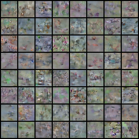
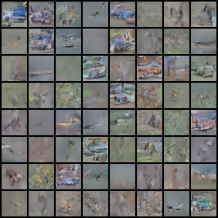
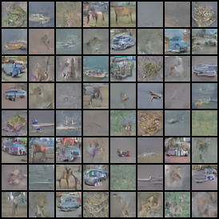
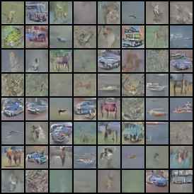
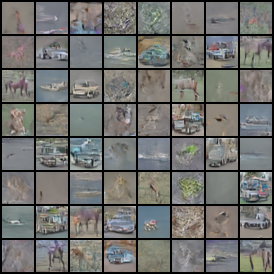
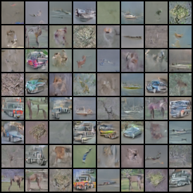

# Denoising Diffusion Probabilistic Model (DDPM) Exploration Project

This project implements a **Denoising Diffusion Probabilistic Model** in PyTorch, focusing on generating high-quality images, trained on the CIFAR-10 dataset. It includes robust features for **training efficiency, reproducibility, and comprehensive experiment tracking**, along with a flexible architecture for conditional image generation.

---

# Selected Diffusion Model Sample Progression

Note: I stopped training at the 13 th epoch when I saw decent enough patterns from the 10 classes appearing.

  This table highlights a selection of generated images from different stages of the model's training, showcasing key points in its learning progression from initial noise to higher fidelity.

<table align="center"; style="width: 80%; border-collapse: collapse; margin: 20px auto; box-shadow: 0 4px 8px rgba(0,0,0,0.1); border-radius: 12px; overflow: hidden;">
  <thead>
    <tr style="background-color: #f9f9f9;">
      <th colspan="2" style="padding: 15px; text-align: center; font-size: 1.2em; color: #333; border-bottom: 2px solid #eee;">Generated Samples</th>
    </tr>
  </thead>
  <tbody>
    <tr>
      <td style="width: 50%; padding: 15px; border-right: 1px solid #eee; text-align: center; vertical-align: middle;">
        
Epoch 0

        
      </td>
      <td style="width: 50%; padding: 15px; text-align: center; vertical-align: middle;">
        
Epoch 5

        
      </td>
    </tr>
    <tr>
      <td style="width: 50%; padding: 15px; border-right: 1px solid #eee; text-align: center; vertical-align: middle;">
        
Epoch 10

        
      </td>
      <td style="width: 50%; padding: 15px; text-align: center; vertical-align: middle;">
        
Epoch 11

        
      </td>
    </tr>
    <tr>
      <td style="width: 50%; padding: 15px; border-right: 1px solid #eee; text-align: center; vertical-align: middle;">
        
Epoch 12

        
      </td>
      <td style="width: 50%; padding: 15px; text-align: center; vertical-align: middle;">
        
Epoch 13

        
      </td>
    </tr>
  </tbody>
</table>

---

## Features

* **Forward and Reverse Diffusion Processes**: Core implementation of how noise is added to, and subsequently removed from, images.
* **Configurable Beta Schedules**: Supports both **linear** and **cosine** schedules for noise injection.
* **Conditional U-Net Architecture**: A powerful neural network designed for noise prediction, capable of handling various conditioning inputs.
* **Classifier-Free Guidance (CFG)**: Enhances the quality and alignment of generated images without requiring a separate classifier.
* **Exponential Moving Average (EMA)**: Crucial for stable training and generating superior samples during inference.
* **GPU Optimization**: Leverages `torch.cuda.amp` (Automatic Mixed Precision) and `torch.compile` for accelerated training.
* **Reproducible Training**: Ensures consistent results across different runs through careful seed management.
* **Comprehensive Logging & Experiment Tracking**: Integrates with TensorBoard for monitoring key metrics and generated samples.
* **Checkpointing**: Allows for saving and resuming training progress.
* **Efficient Data Loading**: Optimized data pipelines for faster throughput.

---

##  Model Overview and Core Components

The project's architecture centers around the `GaussianDiffusion` class, which orchestrates the diffusion processes, and a **Conditional U-Net** that acts as the noise prediction backbone.

### GaussianDiffusion: The Diffusion Orchestrator

This class manages the two main phases of a DDPM: the fixed forward process and the learned reverse (denoising) process.

* **Forward Diffusion Process**: This is a predefined, non-learnable process that gradually adds Gaussian noise to a clean image `x_0` over `T` timesteps. The noisy image at timestep `t`, `x_t`, is obtained by:
    `x_t = sqrt(alpha_bar_t) * x_0 + sqrt(1 - alpha_bar_t) * epsilon`
    where `epsilon ~ N(0, I)` is pure Gaussian noise, and `alpha_bar_t = product(1 - beta_s)` from `s=1` to `t`. The values `beta_s` are determined by the chosen **noise schedule**.

* **Reverse Denoising Process**: This is the learned process where the model iteratively removes noise to transform a noisy image `x_t` back to a clean image `x_0`. The U-Net model predicts the noise `epsilon_theta(x_t, t)`, which is then used to estimate the mean and variance of the reverse Gaussian transition `p_theta(x_{t-1} | x_t)`.
    The predicted mean `mu_theta(x_t, t)` is typically parameterized as:
    `mu_theta(x_t, t) = (1 / sqrt(alpha_t)) * (x_t - (beta_t / sqrt(1 - alpha_bar_t)) * epsilon_theta(x_t, t))`
    The variance `Sigma_theta(x_t, t)` is usually fixed to `beta_t * I` or `tilde_beta_t * I`, where `tilde_beta_t = (1 - alpha_bar_{t-1}) / (1 - alpha_bar_t) * beta_t`.

* **Training Loss Calculation**: The model is trained to minimize a **simplified variational bound**, which simplifies to a Mean Squared Error (MSE) loss. Specifically, the U-Net is trained to predict the noise `epsilon` that was added to create `x_t` from `x_0`.
    `L_simple = E_t,x_0,epsilon [ ||epsilon - epsilon_theta(sqrt(alpha_bar_t) * x_0 + sqrt(1 - alpha_bar_t) * epsilon, t)||^2 ]`
    Here, `epsilon` is the ground truth noise, and `epsilon_theta(x_t, t)` is the noise predicted by our U-Net model.

### Noise Schedules

The way noise is introduced during the forward process is crucial. This project supports two common schedules for generating `beta_t` values:

* **Linear Schedule**: `beta_t` increases linearly from a starting value (`beta_start`) to an ending value (`beta_end`) over `T` timesteps.
    `beta_t = beta_start + ((t-1) / (T-1)) * (beta_end - beta_start)`
* **Cosine Schedule**: A more robust schedule that starts with very small noise and gradually increases, leading to better sample quality, especially with many timesteps.
    `beta_t = min(1 - (cos^2((t+c)/(T+c) * pi/2)) / (cos^2(c/(T+c) * pi/2)), beta_max)`
    where `c` is a small offset (e.g., 0.008) and `beta_max` caps the maximum noise.

### Conditional U-Net Architecture

The heart of the denoising process is a U-Net, a convolutional neural network designed for pixel-wise prediction tasks.

* **Encoder-Decoder Structure with Skip Connections**: The U-Net employs a contracting path (encoder) to capture semantic context by downsampling features and an expansive path (decoder) that upsamples features. Crucially, **skip connections** directly link corresponding resolution levels between the encoder and decoder, preserving fine-grained details vital for high-fidelity image generation.
* **Residual Blocks & Spatial Self-Attention**: The network incorporates **residual blocks** to facilitate deeper architectures and improve training stability. **Spatial self-attention layers** are strategically placed (typically at lower resolutions) to capture global dependencies and long-range correlations within the image.
* **Time Embeddings**: The timestep `t` is encoded into a high-dimensional vector using **sinusoidal positional embeddings**. These embeddings are integrated into the U-Net's layers, allowing the network to adapt its denoising operation based on the current noise level.
* **Conditional Inputs (e.g., Class Labels)**: For conditional generation, additional information like class labels (`y`) can be provided. These are embedded and combined with the time embeddings, guiding the U-Net to generate images belonging to a specific category.
* **Classifier-Free Guidance (CFG)**: During training, the U-Net learns both conditional and unconditional generation. At inference, CFG combines these capabilities to steer the generation process more strongly towards the desired condition `y` without needing a separate classifier. The final noise prediction is a weighted sum:
    `epsilon_pred = (1 + guidance_scale) * epsilon_theta(x_t, t, y) - guidance_scale * epsilon_theta(x_t, t, None)`
    The `guidance_scale` controls the strength of this conditioning.

---

## Training Best Practices & Efficiency

This project incorporates several best practices for robust and efficient training:

* **Exponential Moving Average (EMA)**: An `EMA_handler` is implemented to maintain a running average of the model's weights. Samples generated using the EMA model typically exhibit smoother and higher quality compared to those from the raw trained model weights.
* **GPU Optimization**:
    * `torch.cuda.amp` (Automatic Mixed Precision): Utilizes `float16` for certain operations, significantly reducing GPU memory consumption and accelerating training on modern GPUs with Tensor Cores.
    * `torch.compile`: Compiles the PyTorch model graph into a highly optimized format (e.g., using the `inductor` backend), leading to substantial performance gains during runtime.
* **Efficient Data Loading**: `torch.utils.data.DataLoader` is configured with `num_workers > 0` for parallel data loading and `pin_memory=True` to ensure faster data transfer to the GPU.
* **Reproducibility**: Strict adherence to setting random seeds for `torch`, `numpy`, and Python's `random` module ensures that experiments are fully reproducible.
* **Smart Memory Management**: Techniques like wrapping inference/validation loops with `torch.no_grad()`, using in-place operations (`_`) where safe, accumulating gradients for larger effective batch sizes, and explicitly calling `del` on unused tensors followed by `torch.cuda.empty_cache()` help manage GPU memory effectively.

---

## Experiment Tracking

Experiment tracking is integrated to monitor and visualize all aspects of the training process:

* **TensorBoard Integration**: A wrapper around `TensorBoard SummaryWriter` provides a unified interface for logging.
* **Detailed Metrics Tracking**: Records training loss and other relevant metrics (e.g., per step, per epoch) for comprehensive performance analysis.
* **Resource Utilization Monitoring**: Tracks GPU memory usage, GPU utilization, and CPU usage (where feasible) to provide insights into system performance bottlenecks.
* **Hyperparameter & Configuration Logging**: All hyperparameters and configuration settings for each experiment are meticulously logged, ensuring complete reproducibility and easy comparison between runs.
* **Generated Sample Logging**: Generated image samples are saved at specified intervals throughout training, offering a visual timeline of the model's learning progression and qualitative improvements.
* **Checkpointing**: The model's state (weights, optimizer state) is periodically saved, enabling training to be gracefully paused and resumed from the last checkpoint.

